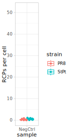
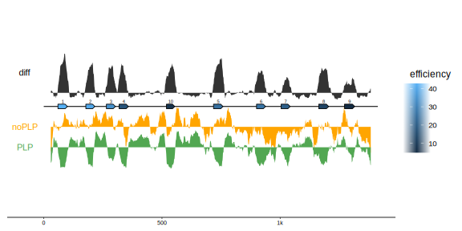
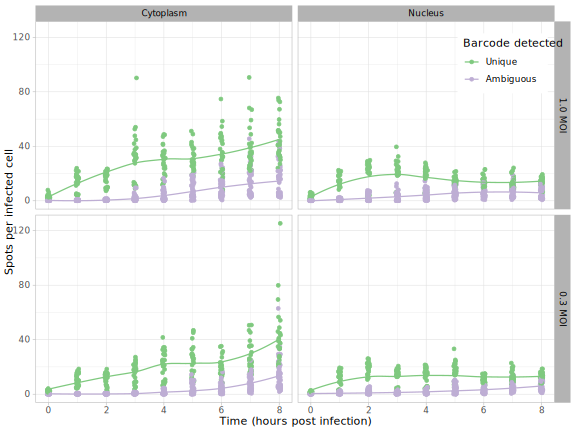
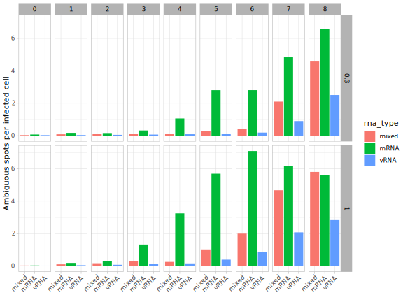

# mudRapp-seq

This repository contains the code that accompanies the paper introducing 
"*Multiple direct RNApadlock probing in combination with in-situ sequencing (mudRapp-seq)*":

> Ahmad S, Gribling-Burrer AS, Schaust J, Fischer SC, Ambil UB, Ankenbrand MJ, Smyth RP.
> *Visualizing the transcription and replication of influenza A viral RNAs in cells by multiple direct RNA padlock probing and in-situ sequencing (mudRapp-seq)*
> (in preparation)

> [!WARNING]
> This repository is a work in progress, so if you notice any errors or have any suggestions, please open an [issue](https://github.com/BioMeDS/mudRapp-seq/issues).

## Data

Raw data is archived independently in the [BioImage Archive (BIA)](https://www.ebi.ac.uk/bioimage-archive/) with accession number **TODO**.
In order to reproduce our analyses, download the raw data from BIA and put them into the `data/raw` folder.

Image data, acquired on the Leica DMI8 were maximum intensity projected along the z-axis and [instant computational clearing (ICC)](https://www.leica-microsystems.com/science-lab/life-science/an-introduction-to-computational-clearing/) was applied using Leica software. These images, with associated metadata consist the raw data of our analysis. Only for one dataset (2nt), the images without ICC were used for cell segmentation. Except for these non-ICC images, all datasets were convertet to [spacetx format](https://spacetx-starfish.readthedocs.io/en/latest/help_and_reference/spacetx-format/SpaceTxFormat/index.html) for further analysis.

All final and some intermediate results are included in the repository to facilitate additional analyses without having to re-process all files from scratch.

### Data sets
- **cDNA_vRNA**: sensitivity of cDNA vs direct vRNA probing ([raw (cDNA, vRNA)](data/raw/2023.11.16_PR8_1MOI_6hpi_cDNA_vRNA_PB1), [raw (cDNA*)](data/raw/2023.11.10_PR8_1MOI_6hpi_cDNA_PB1), [spacetx](data/spacetx/cDNA_vRNA))
- **specificity**: specificity of PLPs with closely related strains PR8 and StPt ([raw](data/raw/2023.11.10_PR8_StPt_1MOI_6hpi_HA_Specificity_experiment))
- **plp_individual**: sensitivity of direct vRNA probing with 10 individual PLPs on the HA and NA segments ([raw HA](data/raw/2023.11.10_PR8_HA_1MOI_6hpi_PLPs1_10_separate), [raw NA](data/raw/2023.11.10_PR8_NA_1MOI_6hpi_PLPs1_10_separate), [spacetx](data/spacetx/plp_individual))
- **plp_cumulative**: sensitivity of direct vRNA probing with increasing number of PLPs on the HA, NA, and PB1 segments ([initial experiment for HA, NA, and PB1](data/raw/2022.02.23_PR8_1MOI_HA_NA_PB1_DiffPLP), [replicates for HA and PB1](data/raw/data/raw/2023.10.19_increasingPLPs_PR8_6hpi_1MOI), [replicates for NA](data/raw/2023.11.10_increasingPLPs_PR8_6hpi_1MOI), [more replicates for HA](data/raw/2023.11.16_increasingPLPs_PR8_6hpi_1MOI), [spacetx](data/spacetx/plp_cumulative))
- **seq_qc**: quality control experiment for the sequencing method, only a single barcode is present in each sample ([raw](2023.09.15_ATGC_test), [spacetx](data/spacetx/seq_qc))
- **seq_2nt**: biologically relevant experiment, simulataneous detection of all viral mRNA and vRNA segments using a 2nt barcode ([raw initial with ICC](data/raw/2022.05.09_PR8_AllSegments_vRNA_mRNA_8hTimepoints_0.3_1_MOI),[raw initial no ICC](data/raw/2022.05.09_PR8_AllSegments_vRNA_mRNA_8hTimepoints_0.3_1_MOI_noICC),[raw replicates with ICC](data/raw/2023.10.19_PR8_AllSegments_vRNA_mRNA_8hTimepoints_0.3_1_MOI),[raw replicates no ICC](data/raw/2023.10.19_PR8_AllSegments_vRNA_mRNA_8hTimepoints_0.3_1_MOI_noICC), [spacetx](data/spacetx/seq_2nt), [intensity_scaled](data/intensity_scaled/seq_2nt))

## Computational environments

### Python environments

To re-create the python environments with [`mamba`](https://github.com/mamba-org/mamba) run:

```bash
mamba env create -f envs/starfish.yml # mudRapp-seq-starfish
mamba env create -f envs/cellpose.yml # mudRapp-seq-cellpose
```

### R environment

The R environment for this project is managed via [`renv`](https://rstudio.github.io/renv/articles/renv.html). A local environment is automatically created for you, when you run `R` or `Rscript` for the first time in the main project directory. This happens because of the `.Rprofile` file.

### jupyter setting (vscode)

The jupyter files are in sub-folders of `code/` but assume the kernel to run in the project root.
This is necessary to make the R kernel use the local renv, and allows to consistently use paths relative to the project root rather than the specific notebook location.
In VS Code this can be achieved by changing the setting `jupyter.notebookFileRoot` to `${workspaceFolder}`.
For `jupyter lab` there seems to be no simple solution at this moment (see [jupyterlab#11619](https://github.com/jupyterlab/jupyterlab/issues/11619)).

## Analyses

### Data formatting

As [`starfish`](https://github.com/spacetx/starfish) is used, the raw data needs to be restructured in SpaceTx format.

In order to create the formatted data in `data/spacetx` run these steps in the root of the `mudRapp-seq` repo and in the `mudRapp-seq` environment:

```bash
mamba run -n mudRapp-seq-starfish python code/data_formatting/cDNA_vRNA.py
mamba run -n mudRapp-seq-starfish python code/data_formatting/specificity.py
mamba run -n mudRapp-seq-starfish python code/data_formatting/plp_individual.py
mamba run -n mudRapp-seq-starfish python code/data_formatting/plp_cumulative.py
mamba run -n mudRapp-seq-starfish python code/data_formatting/seq_qc.py
mamba run -n mudRapp-seq-starfish python code/data_formatting/seq_2nt.py
```

For cell segmentation in the seq_2nt dataset, the intensity of raw images without ICC need to be re-scaled, such that the autofluorescence within the cell is amplified:

```bash
mamba run -n mudRapp-seq-starfish python code/data_formatting/seq_2nt_scale_intensity.py
```

### Segmentation

Images were separately segmented for nuclei and cell instances.
Nuclei segmentation is used to separate spots based on their location into nucleus and cytoplasm.
Cell segmentation is used to count spots per cell, filter infected cells and perform single cell analyses.

For nucleus segmentation, a cellpose model (`models/cellpose/nuclei`) was trained and applied to the raw dapi images (in spaceTx format).
The model was trained on a total of X images with human provided sparse labels (list of images for training in file X) **TODO @Joél**.

For cell instance segmentation, two different approaches were used:
1. Watershed of the dapi image with nuclei as seeds
2. A separate cellpose model with manual correction (details below)

#### Strategy 1 (nuclei via cellpose, cells via watershed)

The first strategy was used for most data, as it was deemed sufficient for filtering of infected cells and to calculate summary statistics like spots per cell.
However, for single cell analyses the cell borders were not reliable enough.

This code performs nuclei segmentation with the cellpose model and watershed for cell segmentation (strategy 1).

```bash
mamba run -n mudRapp-seq-cellpose python code/segmentation/cellpose_nuclei_watershed_cells.py
```

#### Strategy 2 (nuclei and cells via cellpose, cells manually corrected)

The separate cellpose model was trained on raw images without ICC (computational clearing by the microscope vendor).
Further, data was preprocessed with intensity scaling (see [code](code/data_formatting/seq_2nt_scale_intensity.py)).
In order to maximize the number of correctly detected cells, the following parameters were used: `cellprob_threshold=-4.0`, `flow_threshold=0.7` based on preliminary experiments.
Resulting masks were post-processed, removing small objects and closing small holes and gaps (see [code](code/segmentation/cellpose_cells.py)).

```bash
mamba run -n mudRapp-seq-cellpose python code/segmentation/cellpose_nuclei.py
mamba run -n mudRapp-seq-cellpose python code/segmentation/cellpose_cells.py
```

Masks produced this way were manually corrected using label editing tools in `napari`.
Manual correction involved extending cells, shrinking cells, moving cell borders and adding new cells (new cells were assigned IDs of 2000 and higher).
The focus of the manual correction was mainly on infected cells, if no visibly infected cells were made out during inspection the FOV was saved unchanged.

The script used for manual correction can be started for a specific replication, MOI, hpi, and fov like this:

```bash
mamba run -n mudRapp-seq-starfish python code/segmentation/manual_correction_via_napari.py --rep 1 --moi 0.3MOI --hpi 7 --fov_index 1
```

The "cells (manually corrected)" layer, can be modified using `napari` tools.
When finished, the layer can be saved in the corresponding folder (e.g. `analysis/segmentation/seq_2nt/rep1/0.3MOI/7hpi/fov_1_cpmc_cells.png`), the infix `_cpmc_` stands for cellpose with manual correction.

### Spot detection

Spot detection is performed using starfish methods. The following command creates csv and netCDF files in `analysis/spot_detection`

```bash
mamba run -n mudRapp-seq-starfish python code/spot_detection/cDNA_vRNA.py
mamba run -n mudRapp-seq-starfish python code/spot_detection/specificity.py
mamba run -n mudRapp-seq-starfish python code/spot_detection/plp_individual.py
mamba run -n mudRapp-seq-starfish python code/spot_detection/plp_cumulative.py
mamba run -n mudRapp-seq-starfish python code/spot_detection/seq_2nt.py
```

This creates separate spots files for each fov, they can be combined to a single `tsv.xz` file for each experiment using

```bash
Rscript code/spot_detection/combine_csvs.R
```

The result of this step is included in the repository:
- `analysis/spot_detection/cDNA_vRNA/all_spots.tsv.xz`
- `analysis/spot_detection/plp_cumulative/all_spots.tsv.xz`
- `analysis/spot_detection/plp_individual/all_spots.tsv.xz`
- `analysis/spot_detection/seq_2nt/all_spots.tsv.xz`
- `analysis/spot_detection/specificity/all_spots.tsv.xz`

### Spot analysis

#### Sensitivity of cDNA vs direct vRNA probing

The main result is the much higher sensitivity for direct vRNA probing compared to cDNA probing.
For details, see the [analysis notebook](code/spot_analysis/cDNA_vRNA.ipynb).
These figures are included in the manuscript as Supp. Fig. 1b and Fig. 1c, respectively.


#### Specificity of padlock probing on closely related strains

The main result is that padlock probing has very high specificity.
There are almost no false positive results of probes designed for another strain.
For details, see the [analysis notebook](code/spot_analysis/specificity.ipynb).
These figures are included in the manuscript as Supp. Fig. 1b and Fig. 1c, respectively.




### Sensitivity of individual padlock probes

To test the sensitivity of individual padlock probes (PLPs), PLPs for ten distinct locations on NA and HA each, have been designed.
The main result is that individual PLPs have different levels of sensitivity.
While most PLPs produce a good number of spots, some PLPs produce almost none.
For details, see the [analysis notebook](code/spot_analysis/plp_individual.ipynb).
These figures are included in the manuscript as Fig. 2c,d and Supp. Fig. 2c,d, respectively.


#### Binding site reactivity with Nano-DMS-MaP

To explain the different efficiencies of the individual PLPs, the reactivity of the binding sites was analyzed with Nano-DMS-MaP, both with and without PLPs bound.
PLP binding reduces the reactivity of the binding sites (as expected).
Further, the binding reactivity (without PLPs) positively correlates with PLP efficiency (both looking at the whole binding site, and only looking at a small window around the junctions).
For details, see the [analysis notebook](code/binding_site_reactivities/plp_profiling.ipynb).
An overview of the reactivities along the NA segment, and the correlations with efficiencies are shown in the manuscript in Fig. 3b,c and Supp. Fig. 3a. The same plots were generated for the HA segment in the same notebook and shown in Supp. Fig. 4a,b,c.




### Sensitivity with increasing number of padlock probes

To test the sensitivity with increasing number of padlock probes per segment, an increasing number of the ten distinct locations on NA and HA, have been used.
The main result is that sensitivity increases with number of PLPs used, but saturates around 6PLPs.
For details, see the [analysis notebook](code/spot_analysis/plp_cumulative.ipynb).
These figures are included in the manuscript as Fig. 2f,g and Supp. Fig. 2f,g, respectively.


### Sequencing quality control

Dedicated experiments have been performed, to check the quality of the sequencing procedure.

#### Channel bleed-through estimation

Based on four experiments, in which only one of the channels (A,G,T, and C) is active in the first round, the bleed-through of signal from each channel to each other channel was estimated.

Only a moderate bleed-through (factor 0.656) was detected from channel A to channel T.

For details, see the notebooks ([analysis](code/seq_qc/channel_bleed_through_analysis.ipynb), [plot](code/seq_qc/channel_bleed_through_plot.ipynb)).
This figure is included in the manuscript as Supp. Fig. 5b.


### Segment analysis

#### Bulk analysis

The molecule and segment counts, relative abundances and ambiguous spots were analysed by MOI and hpi, separately for nucleus and cytoplasm.

For details, see the [analysis notebook](code/segment_analysis/seq_2nt_bulk.ipynb).
These figures are included in the manuscript as Fig. 5c,d and Supp. Fig. 7a,b, and 9a,b respectively.





**TODO** describe TemporalCorrelation_mRNA_vRNA
